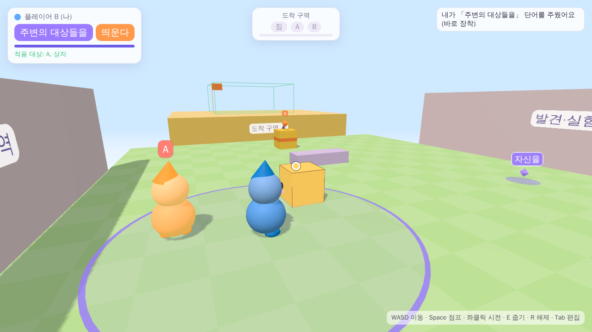
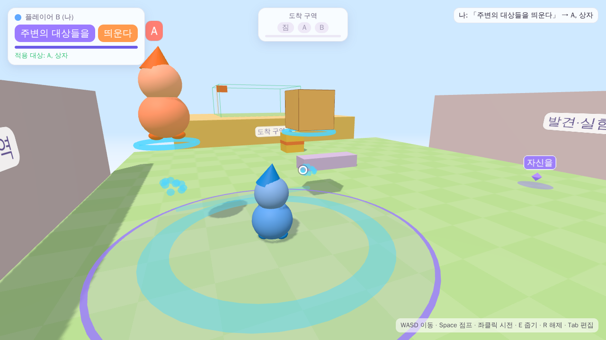
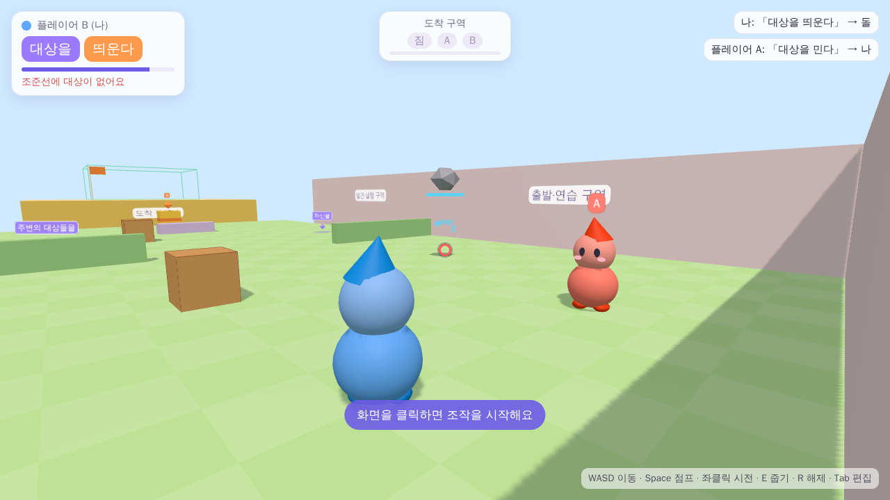
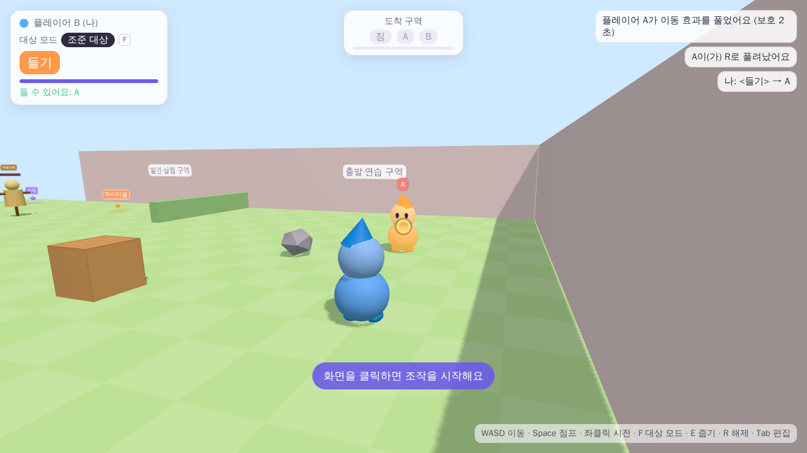
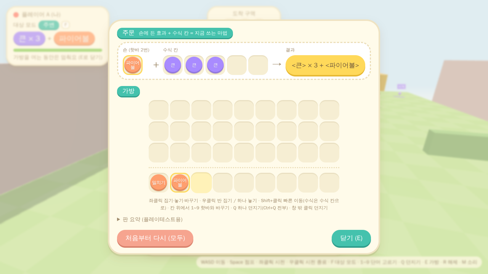
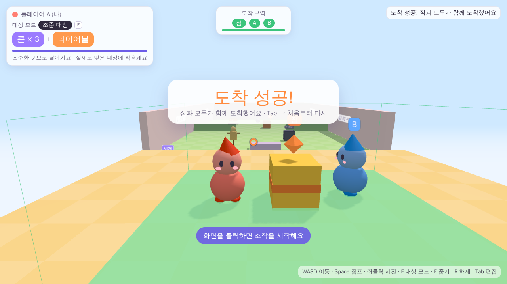

# 단어로 만드는 마법 — 2인 협동 최소 프로토타입

[기획서 v0.2](docs/design_v02.md)의 **06 최소 프로토타입**을 실행 가능한 프로젝트로 구현한 것입니다.
핵심은 **「대상 지정 규칙 × 작용」** 입니다. 사물마다 전용 주문을 만들지 않았고, 같은 주문을 친구·돌·상자에 똑같이 쓸 수 있습니다. 단어를 주고받으면 만들 수 있는 문장이 바뀝니다.

| 범위 미리보기 | 「주변의 대상들을 띄운다」 |
| --- | --- |
|  |  |
| **「대상을 띄운다」로 돌을 띄움** | **R 해제 후 보호 상태 (상대 화면)** |
|  |  |
| **Tab 주문 편집** | **도착 성공** |
|  |  |

> 스크린숏은 자동 테스트(헤드리스 Chromium, 소프트웨어 렌더링)에서 찍었습니다. 한글 글꼴은 대체 글꼴로 표시되었습니다.

---

## 1. 사용한 환경과 버전

기존 프로젝트가 없어서 접근 가능한 환경을 확인한 뒤 아래 구성을 골랐습니다.

| 구분 | 사용 기술 | 버전 |
| --- | --- | --- |
| 호스트(판정·동기화) | Node.js + [`ws`](https://github.com/websockets/ws) | Node 22.22 (20 이상), ws 8.22.0 |
| 클라이언트(3D·3인칭) | 브라우저 + [three.js](https://threejs.org) | three 0.186.1 |
| 테스트 | `node:test`, Playwright(선택) | Playwright 1.56 (Chromium) |

**Unity나 Godot 대신 웹을 고른 이유:** 이 작업 환경에서 두 클라이언트를 실제로 띄워 **접속·동기화까지 자동으로 검증**할 수 있는 구성이 이것뿐이었습니다. 따로 설치하는 엔진 없이 PC 브라우저로 실행되는 **3D·3인칭·실제 네트워크 2인** 게임입니다.

## 2. 실행과 접속

### 설치 없이 바로 해 보기 (혼자 해보기)

**https://claude.ai/artifact/9Rq35hyjX6TXJRiEDhBAPf** 링크를 열고 **시작하기**를 누르면 됩니다(PC 브라우저, 키보드·마우스).
서버 없이 호스트 판정 코드(`server/game.js`)를 브라우저 안에서 그대로 돌리며, 한 사람이 **Q로 A와 B를 번갈아** 조작합니다. 규칙과 판정은 2인 모드와 같습니다. 두 사람이 각자 조작하려면 아래 호스트 실행 방법을 쓰세요.
같은 모드는 호스트 실행 후 로비의 **혼자 해보기** 버튼이나 `http://localhost:8080/?solo`로도 열 수 있습니다. 링크용 페이지는 `node scripts/build-play.mjs`로 `dist/play.html`에 만들어집니다.

### 두 사람이 각자 조작하기 (호스트 실행)

```bash
cd word-magic-coop
npm install
npm start            # 호스트 실행 (기본 포트 8080, 바꾸려면 PORT=9000 npm start)
```

터미널에 접속 주소가 표시됩니다.

- **같은 PC에서 두 명(테스트):** 브라우저 창 두 개로 `http://localhost:8080`을 열고 각각 **참가하기**를 누릅니다.
- **같은 로컬 네트워크에서 두 명:** 호스트 PC는 `http://localhost:8080`, 친구는 `http://<호스트 IP>:8080`에 접속합니다. 로비 화면에도 이 주소가 표시됩니다.
  - Windows에서는 처음 실행할 때 방화벽 창이 뜨면 **개인 네트워크 허용**을 선택하세요.
- 먼저 들어온 사람이 **A**, 두 번째가 **B**입니다. 두 명이 모이면 바로 시작하고, 세 번째 접속은 거절합니다.
- 인터넷 자동 매칭, 원격 초대, 릴레이는 **지원하지 않습니다**(기획서 범위 밖).

> **호스트 구조:** 호스트 PC에서 실행한 Node 프로세스가 토큰 소유권, 줍기·내려놓기, 주문 유효성, 효과, 사물 위치, 클리어를 확정합니다. 두 플레이어(호스트 본인 포함)는 모두 브라우저로 이 프로세스에 접속해 **요청만 보내고 결과를 받아 반영**합니다. 그래서 호스트 쪽 시전과 게스트 쪽 시전이 같은 검증 경로를 거칩니다.

## 3. 조작법

| 입력 | 기능 |
| --- | --- |
| WASD / 마우스 / Space | 이동 / 시점·조준 / 점프 |
| 좌클릭 | 현재 문장 시전 (처음 클릭은 마우스 잠금) |
| E | 가까운 단어 줍기 (해당 분류 슬롯이 비어 있으면 바로 장착) |
| R | 자신에게 걸린 부양·외부 이동 해제 + 다른 사람의 이동 마법에 2초 면역 |
| Tab | 주문 편집: 인벤토리, 두 슬롯 장착·비우기, 단어 내려놓기, 처음부터 다시(두 번 눌러 확인) |
| Q | (혼자 해보기) A·B 조작 전환 — 전환하면 이전 캐릭터는 그 자리에 멈춤 |
| Esc | 마우스 잠금 해제 / 편집창 닫기 |

- 플레이어당 활성 주문은 1개입니다. 한 번 편집하면 좌클릭만으로 반복 시전합니다. 재사용 대기는 1초이고 마나는 없습니다.
- 편집창이 열려 있는 동안에는 카메라 회전과 시전이 막힙니다(이동은 가능).
- HUD에는 현재 문장, **적용 대상 미리보기**(대상 강조와 십자선 색, 범위 주문은 반경 원), 대기시간 막대, 줍기 안내, 획득·교환 기록, 보호·부양 상태, 도착 구역 현황이 표시됩니다.
- 무효 조합이나 무효 대상이면 이유를 짧게 표시하며, 이때는 대기시간을 쓰지 않습니다.

## 4. 테스트 공간

작은 고정 공간 하나에 세 구역을 배치했습니다(`shared/level.js`).

| 구역 | 구성 |
| --- | --- |
| 출발·연습 (벽으로 막혀 있어 떨어질 위험 없음) | A·B 시작 위치, 돌 1개, 상자 1개 |
| 발견·실험 | 「자신을」「주변의 대상들을」이 바닥에 고정 배치, 상자 1개, 낮은 턱 |
| 도착 (가장자리가 열려 있어 떨어질 수 있음) | 목표 짐(금색, ★ 표식), 높이 1.6m 단차, 단차 위 도착 구역(초록) |

- 시작 단어: A = 대상을 + 민다, B = 대상을 + 띄운다. 월드에 자신을 ×1, 주변의 대상들을 ×1이 있어 **토큰은 모두 6개**입니다.
- 점프 높이는 약 1.06m라서 단차(1.6m)에 바로 오를 수 없습니다. 띄우기(+2m) 외에 상자를 밟고 오르는 방법도 막지 않았지만, **짐은 띄우지 않으면 올릴 수 없습니다.**
- 성공 조건: 목표 짐과 두 플레이어가 도착 구역에 **2초 이상 함께** 있으면 됩니다. 어떤 주문을 어떤 순서로 썼는지, 단어를 몇 번 교환했는지는 검사하지 않습니다.

## 5. 규칙 구현 요약

**처리 흐름**(`server/game.js` → `onCast`)

```
보유 단어 확인 → 대상 지정 규칙으로 대상 목록 결정 → 대상별 공통 속성·보호 상태 검사 → 작용 적용 → 결과 동기화
```

- 단어는 `ID · 표시명 · 슬롯 분류 · 선택 규칙 ID 또는 작용 ID`로만 정의되고(`shared/words.js`), 문장은 두 토큰을 참조할 뿐입니다. 여섯 가지 문장을 따로 구현하지 않았습니다.
- 대상 선택(`selectTargets`)과 적용 가능 여부(`applicability`)는 분리되어 있습니다(`shared/targeting.js`). 캐릭터와 이동 사물은 `movable`·`floatable` 속성을 모두 가지고, 고정 지형은 아무 속성도 없습니다.
- **대상을(AIMED):** 화면 중앙 조준선이 처음 맞힌 것 하나를 고릅니다. 시전자 자신은 제외하고, 거리는 시전자 중심에서 대상 중심까지 최대 8m입니다. 벽에 막히면 그 벽이 선택되지만, 지형이라 작용을 받지 않습니다.
- **자신을(SELF):** 조준과 관계없이 자신만 고릅니다.
- **주변의 대상들을(NEARBY):** 시전자 중심 반경 3m 안에서 자신을 빼고 모두 고릅니다. 지형에 가려진 대상은 빠지고, 아군인지 사물인지는 가리지 않습니다. 대상 목록은 시전하는 순간 한 번만 정합니다.
- **민다(PUSH):** 시전자에서 대상 쪽으로 수평 속도를 +4m/s 더합니다. 자기 자신이거나 위치가 겹치면 카메라의 수평 전방으로 밉니다. 외부 수평 속도의 상한은 8m/s입니다.
- **띄운다(LIFT):** 기준 높이에서 2m 위로 올려 3초간 띄운 뒤 정상 중력으로 돌아갑니다. 공중에서 반복하면 **높이는 쌓이지 않고 지속시간만 갱신**됩니다. 착지해야 새 기준 높이가 잡히며, 떠 있는 물체 위에 서 있을 때는 기준을 갱신하지 않습니다.
- 입력 이동과 마법(외부) 이동은 따로 보관한 뒤 더합니다. 그래서 떠 있는 짐을 밀면 공중에서 미끄러지듯 움직이고, 걷기 입력이 마법 이동을 덮어쓰지 않습니다.
- 물체 위에 서면 그 물체와 함께 이동합니다. 떠오르는 물체는 위에 올라탄 것도 함께 들어 올립니다.
- **보호·복구:** R은 부양과 외부 이동을 풀고, 다른 사람의 이동 마법을 2초간 막습니다(자기 시전은 적용됨). 보호 상태는 양쪽 화면에 방패로 표시됩니다. 떨어지면 **마지막으로 서 있던 지면에서 가장 가까운 안전 지점**의 빈자리로 돌아오며, 이때 효과와 속도가 초기화됩니다. 보유한 단어는 그대로 유지됩니다. 떨어진 단어도 안전 지점으로 돌아옵니다.
- **소유·교환:** 각 토큰은 월드 또는 한 사람의 인벤토리 중 한 곳에만 있습니다. 장착한 단어를 내려놓으면 그 슬롯이 비지만, 이미 발동한 효과는 원래 지속시간까지 유지됩니다. 호스트가 요청을 하나씩 순서대로 처리하므로, 동시에 줍기를 눌러도 한 사람만 가져갑니다.
- **재시작**(Tab → 처음부터 다시): 위치, 소유권, 슬롯, 효과, 대기시간이 모두 최초 상태로 돌아갑니다.
- **연결 끊김:** 한 명이 나가면 남은 사람에게 안내한 뒤 로비로 돌아갑니다. 새 상대가 들어오면 처음부터 시작합니다. 호스트 이전은 없습니다.

## 6. 조절 가능한 수치 (`shared/tuning.js`)

서버 판정과 클라이언트 미리보기가 같은 파일을 씁니다.

| 수치 | 기본값 | 설명 |
| --- | --- | --- |
| `aimedMaxRange` | 8 m | 「대상을」 최대 거리 |
| `nearbyRadius` | 3 m | 「주변의 대상들을」 반경 |
| `pushDeltaV` | 4 m/s | 「민다」 속도 변화 |
| `extMaxSpeed` | 8 m/s | 외부 수평 속도 상한 |
| `extGroundFriction` / `extAirDrag` | 6 / 1.2 m/s² | 밀린 뒤 감속 (지면 / 공중·부양) |
| `liftHeight` / `liftDuration` | 2 m / 3 s | 부양 높이 / 시간 |
| `castCooldown` | 1 s | 재사용 대기 |
| `releaseImmunity` / `releaseCooldown` | 2 s / 0 s | R 보호 시간 / R 재사용 대기 |
| `walkSpeed` / `jumpSpeed` / `gravity` | 5 m/s / 6.5 m/s / 20 m/s² | 점프 높이 약 1.06m |
| `pickupRadius` | 2 m | 줍기 거리 |
| `goalHoldTime` | 2 s | 도착 구역에서 버텨야 하는 시간 |
| `killY` | −12 m | 이 높이 아래로 떨어지면 복구 |
| `tickRate` / `snapshotRate` / `interpDelay` | 60 / 30 Hz / 0.07 s | 시뮬레이션·동기화·보간 |
| `aimHistory` | 1 s | 조준 판정용 과거 위치 기록 길이 |

지형과 배치(높이, 거리, 단어 위치)는 `shared/level.js`에서 바꿀 수 있습니다.

## 7. 폴더 구조

```
word-magic-coop/
  server/
    index.js     호스트: 정적 파일 + WebSocket 방(정확히 2명) + 60Hz 시뮬레이션 루프
    game.js      권한 게임 상태: 시전 판정, 토큰 소유, 복구, 클리어, 스냅숏
    physics.js   회전 없는 AABB 물리 (입력/외부 속도 분리, 올라타기, 들어 올리기)
  shared/        서버·클라이언트 공용 (브라우저에서도 그대로 import)
    words.js     단어 5종 정의
    targeting.js 대상 지정 규칙 3종 + 적용 가능 여부
    level.js     테스트 공간
    tuning.js    조절 수치
    geom.js      AABB·레이캐스트
  client/        브라우저 (three.js 렌더링, 입력, HUD, 편집창, 스냅숏 보간)
    local.js     혼자 해보기: 판정 코드를 브라우저 안에서 돌리는 연결(웹소켓과 같은 모양)
  test/          node:test (시뮬레이션 T2~T7, 네트워크 T1)
  scripts/e2e.mjs 브라우저 두 개로 실제 화면 확인 (Playwright)
  scripts/build-play.mjs 링크로 여는 혼자 해보기 페이지 생성 → dist/play.html
```

## 8. 실제로 수행한 테스트

```bash
npm test          # 단위·시뮬레이션·네트워크 테스트 21개
npm run e2e       # (선택) 브라우저 두 개 E2E. playwright가 필요합니다:
                  #   npm i -D playwright && npx playwright install chromium
```

테스트 환경: Linux 컨테이너, Node 22.22.2, Playwright 1.56의 헤드리스 Chromium(GPU 없이 SwiftShader 소프트웨어 렌더링), 두 클라이언트는 **같은 머신**.

| 번호 | 확인 방법 | 결과 |
| --- | --- | --- |
| T1 | `test/net.test.js`: 실제 WebSocket 클라이언트 2개가 호스트에 접속. **같은 틱의 스냅숏이 두 클라이언트에서 완전히 같은지** 비교하고, 이동·시전 이벤트·교환 결과가 양쪽에 반영되는지 확인. 3번째 접속 거절, 끊김 → 로비, 재접속 → 초기화도 확인. `e2e.mjs`: 브라우저 두 개에서 이동·밀기·부양·보호 상태·내려놓은 단어가 상대 화면에 보이는지 확인 | 통과 |
| T2 | 문장을 바꾸지 않고 「대상을 띄운다」를 친구·돌·상자에 차례로 적용 (시뮬레이션과 브라우저 모두) | 통과 |
| T3 | 여섯 조합 각각의 대상 목록과 효과 방향. SELF는 자신만, NEARBY는 자신 제외·반경 밖 제외·가림 제외, 울타리 너머는 관통하지 않음, 무효 요청은 대기시간을 쓰지 않음 | 통과 |
| T4 | 떠 있는 상자를 밀면 높이를 유지한 채 수평 이동. 반복 부양해도 높이가 쌓이지 않음. 연속 밀기는 8m/s 상한. 걷기가 마법 이동을 덮어쓰지 않음. 올라탄 캐릭터가 함께 이동 | 통과 |
| T5 | 교환에 따라 가능한 문장이 바뀌고, 이미 발동한 효과는 유지. 같은 틱에 두 사람이 동시에 줍기, 낭떠러지 밖에 내려놓은 단어 복구, 재시작 후에도 **토큰 6개·단일 소유권** 불변식 유지 | 통과 |
| T6 | R 해제와 2초 면역(다른 사람 시전은 거절, 자기 시전은 적용, 2초 후 다시 적용됨). 보호 상태가 상대 화면에도 표시. 사람과 짐이 낙하 후 같은 구역으로 복구되고 바로 다시 움직임 | 통과 |
| T7 | ① 도착 구역에 2초 이상 함께 있으면 성공, 잠깐 나가면 타이머 초기화, 재시작 후 초기화. ② **입력 메시지만으로 끝까지 진행하는 경로 1개**: B가 짐을 띄우고 → A가 공중의 짐을 밀어 단차 위로 → B가 A를 띄우고 → B는 「자신을 띄운다」로 올라가 → 도착 → 성공 | 통과 |
| 조준 일치 | 클라이언트는 보간 때문에 약간 과거를 보여 줍니다. 그래서 시전 요청에 **화면에 그린 시점**을 함께 보내고, 호스트는 그 시점의 위치로 대상을 고릅니다. 빠르게 움직이는 대상으로 이 동작을 확인 | 통과 |

E2E(`npm run e2e`)는 15개 항목을 확인하며, 마지막 수정 뒤 연속 실행에서 모두 통과했습니다. 그중 [시각]으로 표시한 두 항목(범위 표시, 도착 성공 화면)은 호스트 상태를 **직접 배치**해 화면 표시만 확인한 것이며, 규칙 검증이 아닙니다.

### 미검증

- **서로 다른 두 PC**를 실제 로컬 네트워크로 연결한 플레이 (같은 머신 두 클라이언트로만 확인)
- 실제 GPU·모니터 환경에서의 화면, 프레임, 마우스 잠금·감도 (헤드리스 소프트웨어 렌더링으로만 확인)
- Windows·macOS의 실행과 방화벽 동작, Firefox·Safari
- **사람이 직접 한 플레이테스트:** 기획서 08절의 재미 검증 항목(자발적 재사용, "이거 붙이면?", 교환 부탁 등)은 아직 관찰하지 않았습니다. 테스트 통과는 기능이 동작한다는 뜻일 뿐, 재미가 검증되었다는 뜻은 아닙니다.
- 여러 경로 중 T7 클리어는 한 가지 경로만 자동으로 끝까지 확인했습니다. 상자를 밟고 오르기, 범위 부양 등 다른 경로는 규칙상 가능하지만 끝까지 돌려 보지는 않았습니다.

## 9. 기획서에 없어서 정한 것과 알려진 문제

**기획서에 명시되지 않아 정한 것** (핵심 경험은 바꾸지 않았습니다)

- 걷기로는 사물을 밀 수 없습니다. 사물은 마법으로만 움직입니다. 캐릭터와 사물은 서로 단단한 장애물입니다.
- 「주변의 대상들을」의 가림 판정에서는 고정 지형만 가리는 것으로 봅니다(다른 사물 뒤의 대상도 선택됨).
- 단어 토큰은 마법의 대상이 아닙니다.
- 단어를 주울 때 같은 분류의 슬롯이 비어 있으면 바로 장착합니다(편의 기능).
- 재시작은 두 사람 중 누구나 Tab 편집창에서 할 수 있으며, 버튼을 두 번 눌러 확인합니다.
- 혼자 해보기(링크 페이지)는 기획서의 "실제 네트워크 2명" 요구를 대신하지 않습니다. 설치 없이 규칙을 먼저 체험하기 위한 보조 모드입니다.
- R의 재사용 대기는 0초입니다(수치로 조절 가능).
- 보간 지연 때문에 조준이 어긋나지 않도록 호스트가 최근 1초의 위치를 기록합니다(위 "조준 일치").

**알려진 문제와 한계**

- **자기 캐릭터에도 약 0.1초의 반응 지연이 있습니다.** 클라이언트 예측 없이 호스트 결과를 보간해 그리기 때문입니다. 로컬 네트워크에서는 플레이할 수 있는 수준이지만, 조작감이 약간 무겁게 느껴질 수 있습니다.
- 물리는 회전 없는 상자(AABB) 충돌입니다. 사물이 구르거나 기울지 않고, 계단을 자동으로 오르지 않습니다(0.5m 턱도 점프해야 함).
- 바닥에 놓인 단어는 고정 지형하고만 충돌합니다. 상자 위에서 내려놓으면 상자를 통과해 아래 지면에 놓입니다.
- 화면이 호스트보다 1초 넘게 뒤처지면(매우 느린 PC 등) 조준 표시와 판정이 다를 수 있습니다.
- 게임 중 재접속과 호스트 이전은 없습니다. 한 명이 끊기면 처음부터 다시 시작합니다.
- 인증이나 암호화가 없습니다. 믿을 수 있는 로컬 네트워크에서 쓰는 것을 전제로 합니다.
- 글꼴은 Google Fonts의 Jua를 불러오고, 오프라인이면 시스템 글꼴로 대체합니다.
- 같은 PC의 두 창으로 테스트할 때는 마우스 잠금이 한 창에만 걸립니다. 창을 번갈아 클릭해야 합니다.
- 그래픽이 버벅이면 주소 뒤에 `?gfx=low`를 붙여 그림자·안티앨리어싱을 끌 수 있습니다(호스트 실행 시).
- 링크 페이지는 휴대폰에서 조작할 수 없습니다(키보드·마우스 전용). three.js를 CDN에서 불러오므로 인터넷 연결이 필요합니다.
- 링크 페이지 자체는 헤드리스 브라우저에서 같은 구조(페이지 + 옆 파일, CDN 경로)로 동작을 확인했지만, claude.ai 뷰어 안에서 직접 플레이해 보지는 못했습니다.

## 10. 다음 단계 (기획서 08절 순서)

1. 두 사람이 직접 플레이하며 08절의 관찰 항목을 기록합니다. 특히 "고정 마법 버튼으로 바꿔도 경험이 같은가"를 봅니다.
2. 필요하면 조작 지연을 줄입니다(자기 캐릭터 예측 이동).
3. 새 작용 1종을 추가해 여러 용도로 쓰이는지 확인합니다.
