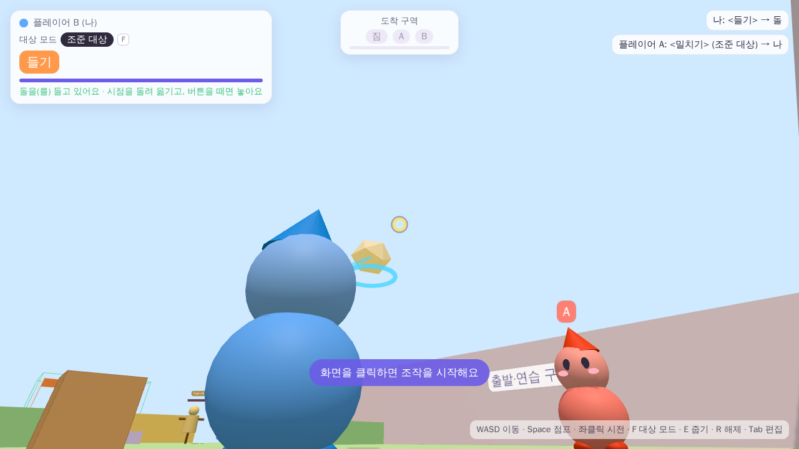
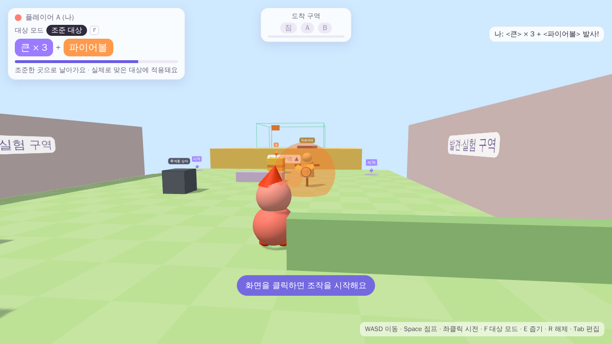
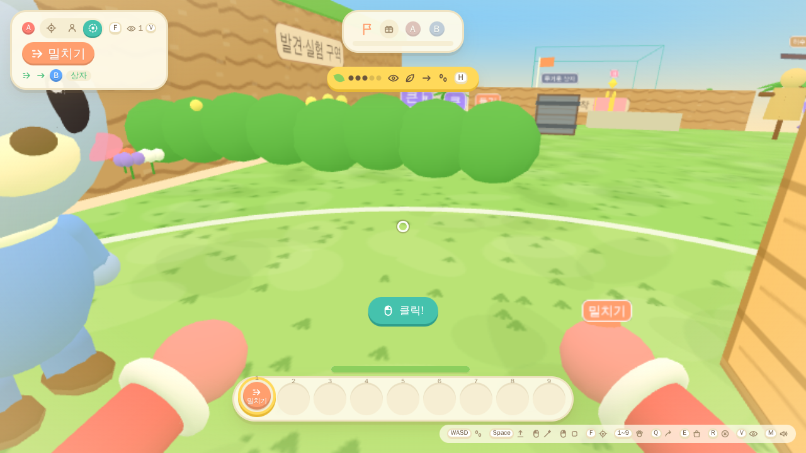
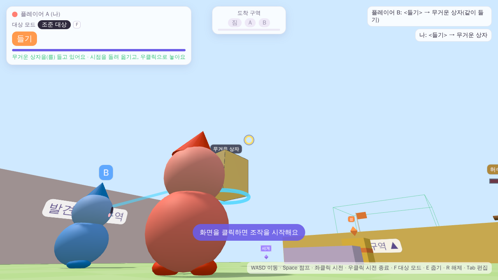
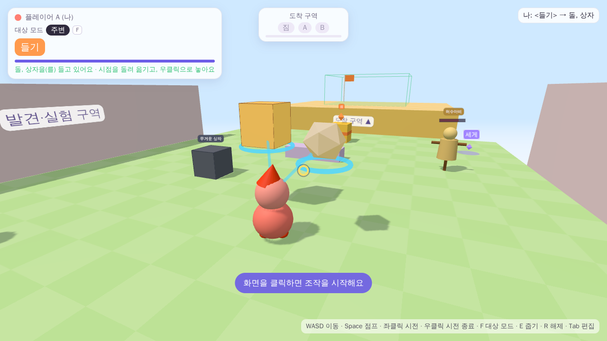
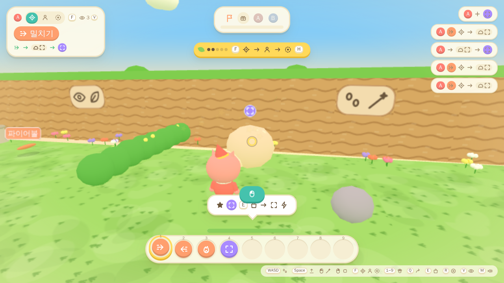
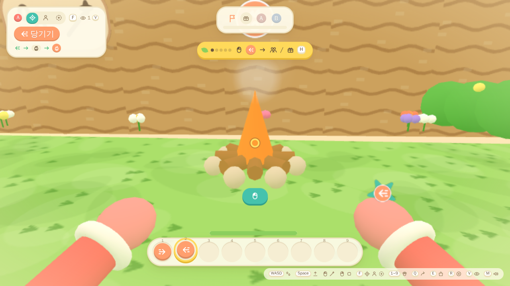
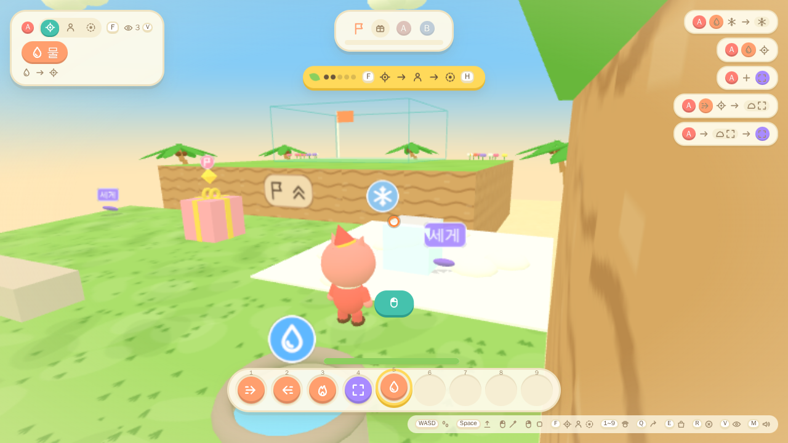
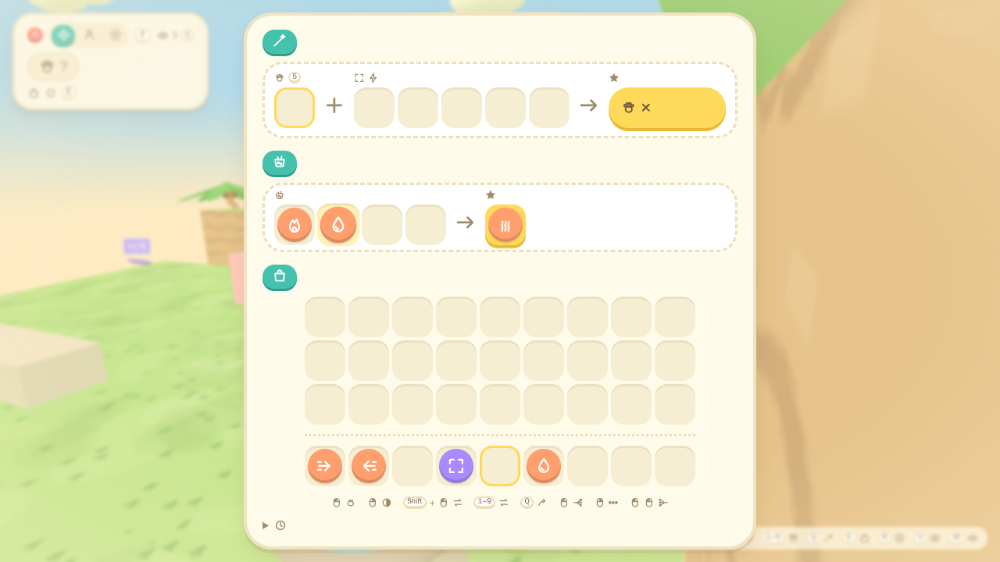

# 단어로 만드는 마법 — 2~6인 협동 프로토타입

[기획서 v0.2](docs/design_v02.md)의 최소 프로토타입에 [추가·변경 기획서 v0.3](docs/design_v03_addendum.md)을 반영한 프로젝트입니다. 충돌하는 부분은 v0.3을 따랐고, 이후 확정된 요구는 [추가 요구사항](docs/design_additions.md)에 모았습니다.

- **주문 = 효과 단어 1개 + 수식 단어.** 수식은 가진 개수만큼 겹쳐 붙입니다. 예: `<큰> × 3 + <파이어볼>`
- **대상은 단어가 아니라 F 키로 바꾸는 대상 모드**입니다(조준 대상 → 본인 → 주변). 대상 지정 단어는 없앴습니다.
- **효과마다 시전 방식이 다릅니다.** 밀치기·당기기는 즉시 한 번, 들기는 **시전 종료할 때까지** 무게·관성 있게 끌고 다니기, 파이어볼은 날아가서 **실제로 맞은 대상**에 적용됩니다.
- **같이 들기:** 혼자 못 드는 물체도 붙잡아 둘 수 있고, 친구가 합류하면 무게를 나눠 같이 들어 올립니다.
- **효과 × 모드:** 주변 들기(여러 개 한꺼번에), 발밑 폭발(본인 파이어볼), 사방 4발(주변 파이어볼), 새 효과 `<당기기>`가 있습니다(3장 표).
- **지속형 마법은 시전자가 '시전 종료'로 직접 끝냅니다**(들기면 놓기, 키는 임시로 우클릭). 친구가 건 마법에서 벗어나는 R과는 별개입니다.
- **마인크래프트식 가방(E):** 위에 **주문 칸**([손에 든 효과] + [수식 칸 5개] → [결과]), 아래 **가방 27칸 + 핫바 9칸**. 마크와 같은 클릭 규칙(좌·우·Shift 클릭, 칸 위에서 1~9·Q, 창 밖 클릭)으로 단어를 옮기고 주문을 짭니다.
- **손 = 고른 핫바 칸**(1~9·휠). **Q로 던지면 친구 몸에 닿아 자동으로 주워집니다.** 바닥의 단어도 걸어가 닿으면 줍습니다(같은 묶음 → 핫바 → 가방 순). 수식은 주워도 자동으로 붙지 않고, 가방에서 수식 칸에 넣어야 붙습니다.
- **3D 그림도 동물의 숲 느낌**: 부드러운 툰 셰이딩, 멀리 갈수록 땅이 둥글게 내려가는 "굴러가는 통나무" 휨, 파스텔 하늘·뭉게구름·바다·모래사장·둥근 나무·야자수·꽃·덤불·풀 덮인 절벽. 캐릭터는 자리마다 다른 동물 주민(A 고양이·B 곰·C 토끼·D 강아지·E 개구리·F 펭귄, 큰 머리·둥근 몸·볼터치·걷기 동작). 효과는 반짝이 별·뭉게 연기·만화 폭발·물보라, 짐은 리본 선물 상자, 바닥 단어는 잎사귀. 느린 컴퓨터에서는 해상도·그림자를 자동으로 낮춥니다(`?gfx=low`로 처음부터 가볍게).
- **UI는 동물의 숲 느낌**: 크림색 종이, 갈색 글씨, 둥글고 통통한 버튼·칸, 말풍선 알림. 실패는 빨간 경고 대신 "앗!"으로 부드럽게, 새 단어를 찾으면 칭찬, 도착하면 꽃가루.
- **1인칭 + 손만 보이기(기본, PEAK 참고):** 화면 아래 양쪽에 내 동물 주민의 두 손만 보입니다. 오른손 위에 지금 든 효과 단어가 뜨고, 시전하면 손을 내밀고, 들기 중에는 두 손을 들어 올리고(무거우면 버둥), 던지면 휙, 주우면 쥐는 동작을 합니다. **V로 3인칭**(어깨 너머)과 바꿉니다.
- **글자 대신 기호:** 사람은 자리 색 동그라미(A·B…), 단어는 색 동그라미 + 그림, 조작은 키 모양 + 그림입니다. 상태·안내·알림·로그·표지판·첫 화면·도착 화면도 기호로 보여 줍니다. 단어 이름은 왼쪽 위 주문 칸(과 바닥에 놓인 단어)에만 글자로 보이고, 마우스를 올리면 이름이 뜹니다.
- **플레이 편의:** '처음 해보기' 안내(그림 순서), 효과음, 판 요약(도착 시·가방에서 복사 가능).
- 적(시험용 허수아비)은 피해를 받고, 친구가 맞으면 체력 대신 **디버프**를 받습니다.
- **세계의 성질을 단어로 얻기(v0.5):** 커다란 바위를 마법으로 조금씩 부수면 작아지면서 `<큰>`이 떨어지고, `<당기기>`로 모닥불에서 `<불>`을, 샘에서 `<물>`을 뽑아냅니다. 새 단어 `<물>`(물방울: 씻기·불 끄기, 눈밭에 닿으면 얼음), `<불>`(데우기: 얼음 녹이기·모닥불 붙이기), `<수증기>`(친구를 띄우기).
- **섞기:** 가방의 섞는 칸 4개에 단어를 넣으면, 놓은 순서와 상관없이 **종류와 개수**로 반응이 정해집니다. 예: `<물>` + `<불>` → `<수증기>`. 자세한 규칙은 [추가 요구사항](docs/design_additions.md)의 2026-10-02 항목.

| 들기(무게·관성, 시전 종료까지 유지) | `<큰> × 3 + <파이어볼>` |
| --- | --- |
|  |  |
| **대상 모드: 주변 (F로 전환)** | **마인크래프트식 가방(E): 위 주문 칸, 아래 27+9칸** |
|  |  |
| **같이 들기: 혼자 못 드는 무거운 상자를 둘이** | **주변 들기: 가벼운 것부터 힘 닿는 만큼** |
|  |  |
| **R로 풀기 후 보호 상태(상대 화면)** | **도착 성공 + 판 요약** |
|  |  |
| **바위를 부수면 작아지며 `<큰>`이 떨어진다** | **`<당기기>`로 모닥불을 겨누면 `<불>`이 나올 것이 보인다** |
|  |  |
| **눈밭에 `<물>`을 쏘면 얼음 덩이** | **섞는 칸: `<불>` + `<물>` → `<수증기>`** |
|  |  |

> 스크린숏은 자동 테스트(헤드리스 Chromium, 소프트웨어 렌더링)에서 찍었습니다. 한글 글꼴은 대체 글꼴로 표시되었습니다.

---

## 1. 사용한 환경과 버전

기존 프로젝트가 없어서 접근 가능한 환경을 확인한 뒤 아래 구성을 골랐습니다.

| 구분 | 사용 기술 | 버전 |
| --- | --- | --- |
| 호스트(판정·동기화) | Node.js + [`ws`](https://github.com/websockets/ws) | Node 22.22 (20 이상), ws 8.22.0 |
| 클라이언트(3D·1인칭/3인칭) | 브라우저 + [three.js](https://threejs.org) | three 0.186.1 |
| 테스트 | `node:test`, Playwright(선택) | Playwright 1.56 (Chromium) |

**Unity나 Godot 대신 웹을 고른 이유:** 이 작업 환경에서 두 클라이언트를 실제로 띄워 **접속·동기화까지 자동으로 검증**할 수 있는 구성이 이것뿐이었습니다. 따로 설치하는 엔진 없이 PC 브라우저로 실행되는 **3D·1인칭(V로 3인칭)·실제 네트워크 2인** 게임입니다.

## 2. 실행과 접속

세 가지 방법이 있습니다. **친구와 인터넷으로 같이 하려면 1번(웹 버전)**을 쓰세요.

| 방법 | 인원 | 필요한 것 |
| --- | --- | --- |
| 1. 웹 버전 (Vercel 등 정적 호스팅) | 2~6명, 각자 PC | 한 번 배포. 이후엔 링크만 |
| 2. claude.ai 링크 | 혼자 (A·B 번갈아) | 없음 |
| 3. 호스트 프로그램 (`npm start`) | 2~6명, 같은 PC·같은 네트워크 | Node.js |

### 1. 웹 버전: 링크로 함께 (P2P, 최대 6명)

**플레이:** 사이트를 열고 **방 만들기** → **링크 복사** → 친구에게 보내기. 친구가 링크를 열면 바로 들어와 시작합니다(로그인·설치 없음). 방 코드 6자리로 직접 들어올 수도 있습니다.

**구조:** 방을 만든 사람(방장)의 브라우저가 호스트가 되어 판정 코드(`server/game.js`)를 그대로 돌리고, 친구 브라우저와 **WebRTC로 직접** 연결합니다(`client/host.js`, `client/p2p.js`). 처음 연결을 맺을 때만 PeerJS 공개 신호 서버를 쓰고, 게임 데이터는 두 브라우저가 직접 주고받습니다. 그래서 서버 프로그램 없이 정적 파일만 올리면 됩니다.

**Vercel 배포(한 번만):**
1. https://vercel.com 에 GitHub 계정으로 로그인 → **Add New… → Project**
2. `jinwoo0402j/a0406` 저장소 **Import** → 설정은 그대로 두고 **Deploy**
   - 저장소 루트의 `vercel.json`이 빌드(`node word-magic-coop/scripts/build-web.mjs`)와 출력 폴더(`word-magic-coop/dist/web`)를 지정합니다.
   - Vercel은 기본 브랜치(`master`)를 정식 주소로 배포합니다. 다른 브랜치의 미리보기 주소는 기본적으로 Vercel 로그인이 필요해 친구가 못 열 수 있습니다.
3. 나온 주소(`https://…vercel.app`)를 열면 됩니다.

직접 빌드하려면 `node scripts/build-web.mjs` → `dist/web/`을 아무 정적 호스팅(GitHub Pages, Netlify 등)에 올려도 됩니다.

**주의**
- 방장이 탭을 닫거나 나가면 게임이 끝납니다(호스트 이전 없음). 방장 탭은 **다른 탭으로 오래 옮기지 마세요.** 브라우저가 백그라운드 탭을 느리게 돌려 게임이 버벅입니다.
- 회사·학교처럼 보안이 엄격한 네트워크에서는 직접 연결이 막힐 수 있습니다. PeerJS가 제공하는 무료 중계(TURN)로 우회를 시도하지만 보장되지 않습니다.
- PeerJS 공개 신호 서버와 jsdelivr CDN(three.js, PeerJS)에 의존합니다.

### 2. 설치 없이 혼자 해보기 (claude.ai 링크)

**https://claude.ai/artifact/9Rq35hyjX6TXJRiEDhBAPf** 링크를 열고 **시작하기**를 누르면 됩니다(PC 브라우저, 키보드·마우스).
서버 없이 호스트 판정 코드(`server/game.js`)를 브라우저 안에서 그대로 돌리며, 한 사람이 **C로 A와 B를 번갈아** 조작합니다. 규칙과 판정은 2인 모드와 같습니다. 두 사람이 각자 조작하려면 아래 호스트 실행 방법을 쓰세요.
같은 모드는 호스트 실행 후 로비의 **혼자 해보기** 버튼이나 `http://localhost:8080/?solo`로도 열 수 있습니다. 링크용 페이지는 `node scripts/build-play.mjs`로 `dist/play.html`에 만들어집니다.

### 3. 호스트 프로그램: 같은 PC·같은 네트워크에서 (`npm start`, 최대 6명)

```bash
cd word-magic-coop
npm install
npm start            # 호스트 실행 (기본 포트 8080, 바꾸려면 PORT=9000 npm start)
```

터미널에 접속 주소가 표시됩니다.

- **같은 PC에서 두 명(테스트):** 브라우저 창 두 개로 `http://localhost:8080`을 열고 각각 **참가하기**를 누릅니다.
- **같은 로컬 네트워크에서 두 명:** 호스트 PC는 `http://localhost:8080`, 친구는 `http://<호스트 IP>:8080`에 접속합니다. 로비 화면에도 이 주소가 표시됩니다.
  - Windows에서는 처음 실행할 때 방화벽 창이 뜨면 **개인 네트워크 허용**을 선택하세요.
- 들어온 순서대로 **A~F** 자리를 받습니다. 2명이 모이면 바로 시작하고, 그 뒤에 들어온 사람은 진행 중인 판에 참가합니다. 7번째 접속은 거절합니다.
- 이 방식은 인터넷 너머의 친구와는 연결하지 않습니다. 인터넷으로 같이 하려면 1번 웹 버전을 쓰세요.

> **호스트 구조:** 호스트 PC에서 실행한 Node 프로세스가 토큰 소유권, 줍기·내려놓기, 주문 유효성, 효과, 사물 위치, 클리어를 확정합니다. 두 플레이어(호스트 본인 포함)는 모두 브라우저로 이 프로세스에 접속해 **요청만 보내고 결과를 받아 반영**합니다. 그래서 호스트 쪽 시전과 게스트 쪽 시전이 같은 검증 경로를 거칩니다.

## 3. 조작법

| 입력 | 기능 |
| --- | --- |
| WASD / 마우스 / Space | 이동 / 시점·조준 / 점프 |
| 좌클릭 | 현재 주문 시전. **들기는 떼도 계속 유지** (처음 클릭은 마우스 잠금) |
| **우클릭** | **시전 종료**: 내가 유지 중인 지속형 마법을 끝냄(들기면 놓기). 키 배정은 [임시] |
| **F** | 대상 모드 전환: 조준 대상 → 본인 → 주변 |
| **1~9 / 휠** | 아래 핫바에서 단어 고르기. **효과 칸을 고르면 그 효과를 손에 듦(장착)** |
| **Q** | 고른 단어 하나를 시선 방향으로 던지기. 친구 몸에 닿으면 친구가 자동으로 주움 |
| (걷기) | 바닥의 단어에 닿으면 자동으로 주움(같은 수식 묶음 → 핫바 빈칸 → 가방 빈칸) |
| **E** / Tab | **가방 열기·닫기** (열려 있는 동안은 멈춤) |
| R | 해제: **친구가 나에게 건** 들림·밀림에서 벗어남 + 다른 사람의 마법에 2초 면역. 내 들기는 끝내지 않음 |
| **V** | 시점: 1인칭(손만 보임, 기본) ↔ 3인칭. 주소에 `?view=third`면 3인칭으로 시작 |

**가방 창 조작 (마인크래프트 규칙)**

| 입력 | 기능 |
| --- | --- |
| 좌클릭 | 칸의 단어 묶음 집기 / 들고 있으면 놓기·같은 수식끼리 합치기·다른 단어와 바꾸기 |
| 우클릭 | 묶음의 반(큰 쪽) 집기 / 들고 있으면 하나만 놓기 |
| Shift+좌클릭 | 빠른 이동: 수식은 빈 수식 칸으로, 수식 칸의 단어는 가방으로, 그 밖에는 핫바 ↔ 가방 |
| 칸 위에서 1~9 | 그 칸과 핫바 n번 칸 바꾸기 |
| 칸 위에서 Q / Ctrl+Q | 하나 / 전부 던지기 |
| 창 밖 클릭 | 들고 있는 단어 던지기(좌클릭 전부, 우클릭 하나) |
| 단어를 든 채 끌기 | 좌클릭: 지나간 칸에 고르게 나눠 놓기(남는 건 커서에) · 우클릭: 칸마다 하나씩 |
| 두 번 클릭 | 같은 수식 단어를 가방·핫바에서 모두 모으기(수식 칸에 붙인 것은 그대로) |
| 닫기 | 들고 있던 단어는 가방으로 돌아감 |

- 주문 칸: **손** = 고른 핫바 칸의 효과 단어(효과만 들어감), **수식 칸 5개** = 한 칸에 하나(수식만 들어감), **결과**에 지금 주문이 단어 표(그림 + 이름)로 `큰×3 파이어볼`처럼 보입니다. 단어에 마우스를 올리면 설명이 뜹니다.
| H | '처음 해보기' 안내 숨기기·보이기 |
| M | 소리 끄기·켜기 |
| C | (혼자 해보기) A·B 조작 전환 |

**효과 × 대상 모드** (— 는 막아 둔 조합)

| 효과 | 조준 대상 | 본인 | 주변 |
| --- | --- | --- | --- |
| 밀치기 | 밀어냄 | 내가 앞으로 밀려남 | 둘레를 바깥으로 |
| 당기기 | 내 앞까지 끌어옴. **지형을 조준하면 내가 그쪽으로 끌려감**(수평만) | — | 둘레를 내 쪽으로 모음 |
| 들기 | 하나를 듦. 혼자 못 들 만큼 무거우면 **붙잡고 친구를 기다림** | — (혼자 높은 곳에 오르면 협동이 깨짐) | 둘레에서 **가벼운 것부터 힘이 닿는 만큼** 여러 개 |
| 파이어볼 | 조준점으로 발사 | **발밑 폭발**: 나는 피해 없이 튀어 오름(땅에서만), 둘레는 폭발을 맞음 | **사방 4발** |

- HUD에는 `대상 모드`와 `현재 주문`(예: `큰 × 3 + 파이어볼`)이 따로 표시됩니다. 대상 모드는 인벤토리 단어가 아닙니다.
- 조준 미리보기: 밀치기·당기기·들기는 적용될 대상을 강조하고, 안 되는 이유나 상태를 보여 줍니다(예: "무거운 상자(혼자서는 무거움 · 같이 들기)"). 파이어볼은 대상을 미리 정하지 않으므로 강조하지 않습니다.
- 무효 조합이나 무효 대상이면 이유를 짧게 표시하며, 이때는 대기시간을 쓰지 않습니다.

## 4. 테스트 공간

작은 고정 공간 하나에 세 구역을 배치했습니다(`shared/level.js`). v0.3 기획서도 기존 테스트 공간을 검증용으로 계속 쓸 수 있다고 했습니다.

| 구역 | 구성 |
| --- | --- |
| 출발·연습 (벽으로 막혀 있어 떨어질 위험 없음) | 시작 위치 A~F, 돌(무게 0.5), 상자(1.0), **`<당기기>` 1개(가운데)** |
| 발견·실험 | `<파이어볼>` 1개, `<큰>` 3개, **`<들기>` 1개(무거운 상자 옆)**, **무거운 상자(3.6: 혼자서는 `<세게>` 없이 못 듦, 둘이면 1.8씩이라 들림)**, **허수아비(시험용 적, 체력 100)**, 낮은 턱 |
| 도착 (가장자리가 열려 있어 떨어질 수 있음) | 목표 짐(금색 ★, 무게 2.6), `<세게>` 2개, 높이 1.6m 단차, 단차 위 도착 구역(초록) |

- 시작 단어: A·C·E는 `<밀치기>`, B·D·F는 `<들기>`입니다. 토큰은 2명이면 10개, 6명이면 14개입니다.
- 월드의 `<들기>`는 2인 플레이에서도 같이 들기를 할 수 있게 둔 것입니다(시작 `<들기>`는 B에게만 있음).
- 들기 힘(기본 3)으로 드는 높이는 무게에 따라 다릅니다. 아래에서 혼자 들면 **친구는 단차 위로 올릴 수 있고, 짐은 단차 높이까지 못 듭니다.** 단차 위에서 끌어올리거나, **둘이 같이 들거나**, `<세게>`로 힘을 키우면 됩니다.
- 성공 조건: 목표 짐과 **접속한 모든 플레이어**가 도착 구역에 **2초 이상 함께** 있으면 됩니다. 어떤 주문을 어떤 순서로 썼는지는 검사하지 않습니다.
- 자동 테스트로 끝까지 확인한 경로가 하나 있습니다. B가 A를 들어 단차 위에 올리고, B가 `<들기>`를 내려놓으면 A가 위에서 주워 B를 끌어올린 뒤, 짐도 끌어올려 도착합니다.

## 5. 규칙 구현 요약 (v0.3 + 제안안)

**처리 흐름**(`server/game.js` → `onCast`)

```
장착한 효과 확인 → 대상 모드가 이 효과에 정의되어 있는지 → 대기시간
  → 밀치기·당기기: 대상 선택 → 공통 속성·보호 검사 → 즉시 적용
  → 파이어볼: 투사체 생성(조준 1발 / 주변 4발) → (매 틱) 이동 → 실제 충돌 → 맞은 대상 확인 → 적/아군 분기 적용
             본인 모드는 발밑에서 바로 폭발
  → 들기: 대상 선택(주변이면 가벼운 것부터 힘 안에서) → 이미 드는 사람이 있으면 합류
          → (시전 종료 전까지 매 틱) 드는 사람들의 목표 지점 평균으로 스프링·감쇠 제어, 버거움에 따라 높이·가속 제한
          → 시전 종료로 놓기
```

- **단어**(`shared/words.js`): 효과 `밀치기 / 당기기 / 들기 / 파이어볼`, 수식 `큰 / 세게`. 대상 지정 단어와 그 칸은 없습니다.
- **대상 모드**(`shared/targeting.js`): 조준 대상(조준선이 처음 맞힌 것 하나, 벽에 막히면 뒤를 찾지 않음), 본인, 주변(시전자 중심 반경, 자신 제외, 지형에 가려지면 제외). 친구·적·사물은 구분하지 않고 **공통 속성**(밀림·들림·피해)으로 판단합니다.
- **밀치기**: 즉시 발동하고 한 번 적용합니다. 준비시간이나 비행 지연은 넣지 않았습니다. 세 모드 모두 v0.2 「민다」의 방향 규칙을 이어받았습니다(시전자 → 대상, 본인이면 카메라 수평 전방).
- **당기기**: 즉시 발동하고 한 번 적용합니다. 대상이 시전자 앞 약 1.2m에서 멈추도록, 지면 마찰로 멈출 거리만큼의 속도를 줍니다(상한 있음). 조준 모드에서 벽·바닥 같은 **지형을 당기면 시전자가 그 지점으로 끌려갑니다.** 수평으로만 움직여 단차를 오르는 데는 못 씁니다. 친구 구해 오기, 물건 가져오기, 이동에 씁니다.
- **파이어볼**: 조준점으로 투사체를 쏩니다. 날아가는 동안에는 아무것도 적용하지 않고, **실제로 맞은 대상**과 작은 폭발 반경 안의 대상에게만 적용합니다. 그래서 조준한 적 대신 앞을 가로막은 친구가 맞을 수 있습니다.
  - 주변 모드는 시선 기준 사방으로 4발을 쏘고, 각각 실제로 맞은 대상에만 적용합니다.
  - 본인 모드는 발밑에서 바로 폭발합니다. 시전자는 피해·디버프를 받지 않고 **땅에 서 있을 때만** 튀어 오릅니다(약 0.6m). 공중에서 쓰면 튀지 않아서 점프와 겹쳐 단차를 넘을 수 없습니다.
- **들기**: 시전하면 시전 종료 전까지 대상이 **시선 방향 앞 지점**을 향해 스프링과 감쇠로 끌려옵니다(`server/physics.js`).
  - 가속도에 상한이 있어서 시점을 돌리면 늦게 따라옵니다.
  - 감쇠가 임계보다 작아서, 시점을 멈추면 조금 더 움직였다가 돌아옵니다.
  - 무거울수록 드는 높이가 낮고 반응이 느립니다.
  - **같이 들기**: 이미 누가 들고 있는 물체를 조준해 들면 합류합니다. 무게는 드는 사람 수로 똑같이 나누고, 높이·반응은 각자의 버거움(나눠 든 무게 합 ÷ 힘)으로 정합니다. 물체는 드는 사람들의 목표 지점 가운데로 갑니다.
  - **붙잡기**: 혼자 힘으로 못 드는 물체도 조준 모드로 붙잡을 수 있습니다. 바닥에서 뜨지 않고(연결선이 붉게, 물체가 버둥거림) 친구가 합류하면 올라갑니다. 들던 중 같이 들던 사람이 놓거나 `<세게>`를 넘겨 힘이 모자라지면, 놓치지 않고 붙잡은 채 내려앉습니다.
  - **주변 들기**: 반경 안의 들 수 있는 것을 가벼운 것부터 힘이 닿는 만큼 들어 시전자 둘레 1.6m 높이에 띄웁니다. 시점을 돌리면 둘레를 따라 같이 돕니다.
  - 나를 직접·간접으로 들고 있는 사람은 들 수 없습니다(서로·고리로 들어 끝없이 올라가는 것 방지). 딛고 선 물체도 못 듭니다.
  - 시전 종료(우클릭)를 누르면 그때의 속도 그대로 놓습니다. 유지하는 동안 다시 시전하면 "시전 종료로 먼저 끝내세요"라고 안내합니다.
  - v0.2의 2m·3초 고정 부양은 없앴습니다.
- **주고받기(마인크래프트식)**: Q로 던진 단어는 시선 방향으로 날아가(약 3~4m) 벽에 막히면 떨어지고, 땅에서는 미끄러지다 멈춥니다. 땅의 단어는 몸에 닿으면(0.9m) 가장 가까운 사람이 자동으로 줍습니다. 던지거나 내려놓은 사람은 1.2초 동안 다시 못 줍습니다. 다른 사람이 던진 것을 주우면 주고받기로 기록됩니다.
- **'처음 해보기' 안내**: 화면 위쪽에 지금 할 일 하나를 보여 줍니다. 기획서의 기본 흐름(단어 발견 → 주문 구성 → 시험·교환 → 함께 도착)을 따라 써 보기 → F 모드 → 새 단어 줍기 → Q로 친구에게 던져 주기 → 목표 순서로 바뀝니다.
- **효과음**: 소리 파일 없이 브라우저에서 합성합니다(`client/sfx.js`). 멀리서 난 소리는 작게 들립니다.
- **판 요약**: 누가 어떤 주문을 친구·물건·자신에게 몇 번 썼는지, 줍기·건네준 단어(던진 것을 친구가 주운 수), 같이 들기, 친구가 파이어볼에 맞은 횟수, R·낙하 횟수를 셉니다. 도착하면 보이고, 가방에서 언제든 열어 복사할 수 있습니다. 플레이테스트를 기억 대신 기록으로 보려는 용도입니다(v0.2 08).
- **수식 중첩**: 실제로 가진 토큰만 셉니다. 넘겨준 단어는 곧바로 빠지고(복제 없음), 가진 개수보다 많이 붙일 수 없습니다. 시전할 때 단어를 소모하지 않습니다.
- **시전 종료와 해제(R)는 별개**: 시전 종료(`endCast`)는 시전자가 **자신이 유지하는** 마법을 끝내는 것이고, R(`release`)은 **친구가 나에게 건** 마법에서 벗어나는 것입니다. 내가 R을 눌러도 내 들기는 계속되고, 다른 사람이 시전 종료를 눌러도 내 들기는 끝나지 않습니다.
- **적·아군 분기**: 파이어볼에 맞으면 적(허수아비)은 체력이 깎이고 0이 되면 쓰러졌다가 3초 뒤 다시 섭니다. 친구는 체력 대신 **그을림 디버프**(2초 동안 이동 속도 절반)를 받습니다. 다시 맞으면 2초로 갱신될 뿐 쌓이지 않습니다(한 친구를 계속 묶어 두는 방해 방지). 시전자 자신은 폭발에서 제외합니다.
- **유지된 규칙**: 단어 단일 소유·교환, 낙하 복구, R 해제·보호, 재시작, 2~6인 참가·퇴장, 호스트 권한 판정과 동기화.

## 6. 조절 가능한 수치와 임시값 (`shared/tuning.js`)

서버 판정과 클라이언트 미리보기가 같은 파일을 씁니다. **[임시]** 표시는 아직 정하지 않은 정책을 구현하려고 둔 값으로, 확정된 기획이 아닙니다. **[제안안]**은 2026-10-01에 승인받은 제안으로, 플레이테스트 뒤 바뀔 수 있습니다.

| 항목 | 값 | 비고 |
| --- | --- | --- |
| 대상 모드 전환 키 | F | [임시] 추천안 |
| 조준 대상 거리 / 주변 반경 | 8m / 3m | [임시] v0.2 값을 시작점으로 사용 |
| 막아 둔 모드 조합 | 본인 + 들기, 본인 + 당기기 | [제안안] 혼자 높은 곳에 오르면 협동이 깨진다 |
| 당기기 속도 상한 / 멈추는 거리 | 9 m/s / 앞 1.2m | [제안안] 지형을 당기면 수평으로만 끌려감 |
| 본인 파이어볼(발밑 폭발) | 땅에서만 5 m/s로 튀어 오름(≈0.6m), 시전자 피해 없음 | [제안안] |
| 주변 파이어볼 | 시선 기준 사방 4발 | [제안안] |
| 주변 들기 | 가벼운 것부터 힘 안에서, 둘레 1.6m 높이, 시점 따라 회전 | [제안안] |
| 같이 들기 | 무게를 사람 수로 똑같이 나눔, 혼자 못 들면 붙잡기만 | [제안안] |
| 밀치기 속도 변화 / 상한 | 4 / 8 m/s | v0.2 값 유지 |
| 파이어볼 속도 / 반지름 / 수명 | 14 m/s / 0.22m / 2.5초 | [임시] 준비시간 없음, 직선 비행 |
| 파이어볼 폭발 반경 / 피해 / 밀림 | 1.0m / 25 / 3 m/s | [임시] |
| 들기 입력 | 시전하면 유지, 시전 종료로 놓기 | 기획 요구(2026-09-30) |
| 시전 종료 키 | 우클릭 | [임시] 키 배정은 추후 결정 |
| 시전 종료 외에 자동으로 끝나는 경우 | 마우스 잠금 해제, 가방 열기, (혼자 해보기) C 전환 | [임시] |
| 유지 중 재시전 | 거절하고 시전 종료 안내 | [임시] |
| 들기 힘 / 거리 / 놓치는 거리 | 3 / 8m / 10m | [임시] |
| 들기 높이 | 발밑 + 3.4·(1 − 버거움) + 0.2. 버거움 = 혼자면 무게/힘, 같이 들면 각자 (나눠 든 무게 합/힘)의 조화 평균 | [임시] |
| 들기 스프링 / 감쇠 / 가속 상한 | 30 / 5 / 30 m/s² | [임시] 무거울수록 가속 상한이 줄어든다 |
| 무게 | 돌 0.5, 상자 1, 허수아비 1.4, 사람 1.6, 짐 2.6, 무거운 상자 3.6 | [임시] |
| 전투 / 월드 | 넣지 않음 / 테스트 방 유지 | [제안안] 플레이테스트 뒤 결정 |
| 던지기 / 자동 줍기 | 수평 6 m/s + 위 3.5 m/s, 줍는 거리 0.9m, 놓은 사람 1.2초 뒤 | [임시] |
| 수식 중첩 | 곱 연산, 최대 5중첩 | [제안안] 5중첩 유지(맵에 `<큰>` 3개뿐) |
| `<큰>` | 파이어볼 반지름·폭발 반경 ×1.35, 밀치기·당기기 거리·반경 ×1.2, 주변 들기 반경 ×1.2 (중첩당) | [임시] 추천안 |
| `<세게>` | 밀치기·당기기 힘 ×1.3, 들기 힘 ×1.4, 파이어볼 피해 ×1.5 (중첩당) | [임시] 추천안 |
| 아군 디버프 | 그을림: 2초 이동 속도 ×0.5, 체력 감소 없음, 다시 맞으면 2초로 갱신(쌓이지 않음) | [제안안] |
| 허수아비 체력 / 다시 서는 시간 | 100 / 3초 | [임시] |
| 재사용 대기 | 1초 (들기는 놓을 때 시작) | [임시] |
| R 보호 시간 | 2초 | [임시] v0.2 규칙 유지 |

지형과 배치(높이, 거리, 단어 위치, 무게)는 `shared/level.js`에서 바꿀 수 있습니다.

## 7. 폴더 구조

```
word-magic-coop/
  server/
    index.js     호스트: 정적 파일 + WebSocket 방(2~6명) + 60Hz 시뮬레이션 루프
    game.js      권한 게임 상태: 시전 판정, 토큰 소유, 복구, 클리어, 스냅숏
    physics.js   회전 없는 AABB 물리 (입력/외부 속도 분리, 올라타기, 들어 올리기)
  shared/        서버·클라이언트 공용 (브라우저에서도 그대로 import)
    words.js     단어 9종 정의(효과 7 + 수식 2), 효과별 대상 모드, 사물 종류별 속성, 반응(섞기)
    targeting.js 대상 모드 3종 + 적용 가능 여부 + 같이 들기 무게 분담
    level.js     테스트 공간(바위·모닥불·샘·눈밭·얼음 포함)
    tuning.js    조절 수치
    geom.js      AABB·레이캐스트
  client/        브라우저 (three.js 렌더링, 입력, HUD, 가방, 스냅숏 보간, 내 캐릭터 예측 predict.js)
    inventory.js 마인크래프트식 가방: 칸 배치, 클릭 규칙, 손·수식 칸 → 서버 장착(loadout)
    look.js      동숲 느낌 그림: 툰 재질, 지면 휨 셰이더, 하늘·바다·나무·꽃, 동물 주민 캐릭터
    host.js      브라우저 안 호스트: 판정 코드를 이 탭에서 돌림 (혼자 해보기 / 방장)
    p2p.js       방 만들기·참가 (WebRTC, PeerJS), 방 코드, 끊김 감지
  test/          node:test (시뮬레이션 T2~T7, 네트워크 T1, v04.test.js: 제안안 반영분, world.test.js: 세계의 성질을 단어로)
  scripts/e2e.mjs 브라우저 두 개로 실제 화면 확인 (Playwright)
  scripts/build-play.mjs 링크로 여는 혼자 해보기 페이지 생성 → dist/play.html
  scripts/build-web.mjs  웹 버전(P2P) 생성 → dist/web/  (Vercel이 이 스크립트로 빌드)
  scripts/e2e-p2p.mjs    웹 버전 E2E: 로컬 신호 서버 + 브라우저 3개로 실제 WebRTC 연결 확인
  scripts/lag-check.mjs  반응 지연 측정: 인위적 지연을 넣은 중계로 내 캐릭터 예측 끔/켬 비교
  scripts/shot-world.mjs 세계의 성질(바위·모닥불·눈밭·섞기) 화면 스크린숏
```

## 8. 실제로 수행한 테스트

```bash
npm test          # 단위·시뮬레이션·네트워크·브라우저 호스트 테스트 37개
npm run e2e       # (선택) 호스트 프로그램 + 브라우저 두 개 E2E. playwright 필요:
                  #   npm i -D playwright && npx playwright install chromium
node scripts/e2e-p2p.mjs   # (선택) 웹 버전 P2P E2E. npm i --no-save peer peerjs playwright
LAG=60 node scripts/lag-check.mjs   # (선택) 한 방향 60ms 지연에서 예측 끔/켬 비교
```

테스트 환경: Linux 컨테이너, Node 22.22.2, Playwright 1.56의 헤드리스 Chromium(GPU 없이 SwiftShader 소프트웨어 렌더링), 클라이언트는 모두 **같은 머신**.

**v0.3 반영 후 확인 기준**

| 번호 | 확인 방법 | 결과 |
| --- | --- | --- |
| T1 | 대상 지정 단어가 단어 정의·레벨에 없음. 같은 `<밀치기>`를 장착 그대로 두고 조준 대상·본인·주변 모드로 각각 적용. 정의되지 않은 조합은 거절. 수식은 효과 칸에 못 넣음. 브라우저에서 F 두 번 → 주변 모드 | 통과 |
| T2 | 파이어볼 발사 순간에는 허수아비 체력이 그대로이고 폭발 이벤트도 없음. 날아가는 도중 B가 앞을 막으면 B가 맞고(디버프) 허수아비는 피해 없음. 막는 사람이 없으면 허수아비가 맞음 | 통과 |
| T3 | 밀치기는 시전한 틱에 바로 적용. 들기는 2초 넘게 유지되며 세 방향으로 돌린 시선을 계속 따라오고, 유지 중에는 재시전 불가, 시전 종료로 놓고 떨어짐. 브라우저에서 실제 마우스로 좌클릭을 뗀 뒤에도 유지되고 우클릭으로 놓는 것을 확인. 시전 종료는 시전자만 가능하고 R과 섞이지 않음 | 통과 |
| T4 | 같은 시선으로 들어도 돌이 짐보다 1m 넘게 높음. 무거운 상자는 혼자 붙잡으면 바닥에서 뜨지 않고(붙잡힘 표시) `<세게>` 1개면 들림. 시선을 일정 속도로 돌리면 늦게 따라오고(지연 확인), 멈추면 지나쳤다가 다시 돌아옴(넘침·복귀 확인). 딛고 선 물체는 못 듦 | 통과 |
| T5 | `<큰>` 0/1/3개에 따라 파이어볼 반지름이 커짐. 가진 것보다 많이 붙이기 요청은 보유 수로 제한. 하나를 넘기면 A 2개·B 1개로 바로 바뀜. 넘긴 `<세게>`로는 더 이상 강화되지 않음(들고 있던 무거운 상자가 내려앉음). `<세게>`는 밀치기 힘을 키움 | 통과 |
| T6 | 같은 파이어볼이 허수아비에게는 피해(4발에 쓰러지고 3초 뒤 회복), 친구에게는 디버프+밀림(체력 없음), 시전자는 제외. 디버프 중 이동 거리가 평소의 75% 미만 | 통과 (**디버프 내용은 임시안**이라 기획 적합성은 미검증) |
| T7 | 실제 WebSocket 클라이언트 2개에서 같은 틱의 스냅숏이 완전히 같음. B가 A를 드는 동안 두 화면의 스냅숏 모두 "A는 B에게 들림"으로 일치. P2P(WebRTC)와 브라우저 E2E에서도 들기·투사체·단어 소유가 상대 화면에 반영됨 | 통과 (시각적 관성은 호스트가 계산하므로 두 화면이 같은 상태를 보간한다. 인터넷 지연에서의 체감은 미검증) |

**제안안 반영분**(`test/v04.test.js`, 모두 통과)

| 항목 | 확인 방법 |
| --- | --- |
| 주변 + 들기 | 돌·상자·친구가 반경 안에 있을 때 무게 합이 힘 안인 돌·상자만 들림(친구 제외). 1.2m 넘게 떠오르고, 시점을 천천히 뒤로 돌리면 좌우가 바뀜. 시전 종료로 모두 떨어짐. 무거운 상자만 있으면 거절 |
| 본인 + 파이어볼 | 폭발이 친구에게 디버프, 허수아비에게 피해, 시전자는 제외. 튀어 오른 높이 0.4~1.0m(단차 1.6m 미만). 점프 중에 쓰면 튀지 않음 |
| 주변 + 파이어볼 | 투사체 4개가 사방으로, 발사 순간엔 아무 효과 없음. 뒤쪽 허수아비가 맞음. 시전자는 자기 투사체에 안 맞음 |
| 같이 들기 | 혼자 붙잡은 무거운 상자는 1초 뒤에도 바닥. 두 번째 사람이 합류하면 0.8m 넘게 올라감. 두 사람이 좌우를 보면 상자가 그 사이. 한 명이 시전 종료하면 다시 내려앉음(붙잡은 채). 친구를 둘이 들면 혼자보다 0.5m 넘게 높고, 들린 친구가 R을 누르면 둘 다에게서 풀림. 2인 플레이에서 월드의 `<들기>`로 같이 듦. 서로·고리로 드는 것은 거절 |
| `<당기기>` | 6m 떨어진 돌이 앞 0.6~2.2m에 멈춤(지나치지 않음). 친구를 2.5m 넘게 끌어옴. 주변 모드로 둘레 것들이 1.8m 안으로 모임. 벽을 당기면 시전자가 3m 넘게 끌려가고 뜨지 않음. 본인 모드와 보호 중인 친구는 거절 |
| 브라우저 E2E | 혼자 붙잡은 상자는 상대 화면에서도 바닥 + 붙잡힘 표시, 안내 문구 표시. 친구가 합류하면 상대 화면에서 들림(드는 사람 2명). 주변 들기 미리보기에 돌·상자 강조, 들면 상대 화면에서 함께 떠오름 |

**유지된 규칙:** 동시 줍기, 낙하한 사람·짐·단어 복구, 재시작, R 해제·보호, 2~6인 참가·퇴장, 같은 사람 재연결, 방장 종료를 모두 자동 테스트로 확인했습니다. 입력만으로 끝까지 협동해서 클리어하는 경로 하나도 자동 테스트로 확인했습니다.

**플레이 편의**(`test/play.test.js`와 브라우저 E2E): Q로 던진 단어가 3m 앞 친구에게 닿아 주워지고 누가 던졌는지 기록됨, 벽을 넘지 않고, 던진 사람은 잠깐 뒤에만 다시 주움, 걸어가 닿으면 줍고 빈 효과 칸이면 바로 장착, 둘이 동시에 닿아도 한 사람만 주움. 브라우저에서 핫바로 고르고 Q로 던지면 상대 화면에서 받음, 첫 화면 안내가 단계별로 바뀜, 도착 시 판 요약 표시.

**브라우저 E2E:** 호스트 프로그램 29/29 통과(연속 3회), P2P 11/11 통과. [시각] 표시 항목은 호스트 상태를 직접 배치해 화면 표시만 확인한 것입니다.

### 미검증

- **들기와 파이어볼의 체감**(무게감·관성·타격감). 수치로는 지연·넘침·복귀를 확인했지만, 사람이 직접 조작해 본 적은 없습니다.
- **인터넷 너머의 조작감**: 들린 물체는 호스트가 계산하므로, 인터넷 P2P에서는 드는 사람 화면에서도 0.1초 넘게 늦게 따라올 수 있습니다.
- 서로 다른 네트워크의 PC끼리 연결, 4~6명 동시 브라우저 접속, 실제 GPU 환경, Windows·macOS
- 제안안과 임시값 전부(아래 9장). 동작만 확인했고, 플레이해서 재미있는지는 확인되지 않았습니다.
- **같이 들기·주변 들기·당기기의 조작감**과, `<당기기>`가 실제로 여러 용도로 쓰이는지(기획서의 "새 작용 1종의 여러 용도 확인")
- 3~6명이 한 물체를 같이 들 때의 화면 표시(자동 테스트는 2명까지)
- 효과음이 실제로 어떻게 들리는지(헤드리스 브라우저라 소리를 들어 보지 못했고, 오류 없이 재생 호출되는 것만 확인)
- 사람이 직접 한 플레이테스트(재미 검증)

## 9. 기획서에서 미정인 것과 알려진 문제

**제안안으로 정한 것** (2026-10-01 승인, [추가 요구사항](docs/design_additions.md)에 기록)

- 모드 조합: 주변 + 들기, 본인 + 파이어볼(발밑 폭발), 주변 + 파이어볼(사방 4발). 본인 + 들기는 막음
- 같이 들기 허용(무게를 나눠 듦), 혼자 못 들면 붙잡기
- 새 효과 `<당기기>`(조준·주변, 지형을 당기면 내가 끌려감). 본인 모드는 막음
- 아군 디버프 2초 둔화 유지, 다시 맞으면 쌓이지 않고 갱신
- 수식 최대 5중첩 유지, 시전 종료 키 우클릭 유지, 전투 없음, 월드는 테스트 방 유지

**아직 임시인 것** (6장 표의 [임시] 값)

- 대상 모드 전환 키(F)와 순서(조준 대상 → 본인 → 주변)
- 밀치기 전달 방식: 즉시 적용(투사체 아님)
- 파이어볼: 준비시간 없음, 직선 비행, 명중 지점 작은 폭발, 시전자 제외
- 들기: 유지 중 재시전 거절, 놓을 때 속도 유지(던지기), 지형에 부딪히면 막힘, 10m 넘게 멀어지면 그 사람만 놓침, `<들기>`를 내려놓거나 바꾸면 놓침, 딛고 선 물체는 못 듦. 무게는 사람 수로 똑같이 나눔(힘 비율로 나누지 않음)
- 수식 공식(곱 연산)과 효과별 대응 항목, 수식 칸 5개
- 보호 중인 친구는 파이어볼도 받지 않음
- 적의 공격, 낙하·충돌 피해, 자기 시전 피해: 없음
- 여러 효과를 한 주문에 섞는 규칙: 없음(효과 1개 + 수식)

**만들지 않은 것:** 보스·일반 전투(허수아비만 있음), 상점·이벤트, 큰 연결형 월드, 음성 반응 입, 완성형 캐릭터. 캐릭터 과장 연출은 **시전하면 몸이 늘어나고, 맞으면 납작해지는** 간단한 형태 변형만 넣었습니다.

**알려진 문제와 한계**

- 다른 사람과 사물은 호스트 결과를 약 0.07초 늦게 보간해 보여 줍니다. **내 캐릭터와 내가 든 물체는 예측**해서 바로 움직이지만(키→움직임 154ms → 64~90ms, 헤드리스 측정), 친구에게 들리거나 물체 위에 타는 등 남이 움직이는 동안에는 보간으로 돌아갑니다.
- 물리는 회전 없는 상자(AABB) 충돌입니다. 들린 물체도 회전하지 않습니다.
- 바닥에 놓인 단어는 고정 지형하고만 충돌합니다.
- 방장·호스트 이전과 게임 중 재접속은 없습니다. 방장이 나가면 끝납니다.
- 링크 페이지는 휴대폰에서 조작할 수 없습니다(키보드·마우스 전용).

## 10. 다음 단계

1. 친구와 플레이하면서 v0.2 08장의 관찰 항목을 봅니다: 사물에도 주문을 쓰는지, 수식을 바꿔 보는지, 단어를 부탁하거나 넘기는지, `<당기기>`를 여러 용도로 쓰는지.
2. 결과를 보고 6장 [임시]·[제안안] 값을 조정합니다.
3. 기획서 순서(v0.2 08장)에 따라 그다음은 모험 목표와 반복 구조를 고릅니다.
4. 인터넷으로 멀리 떨어진 친구와 해 보고, 내 캐릭터 예측의 보정(살짝 밀려나는 느낌)이 거슬리면 보정 속도를 조정합니다.
